# 项目功能展示

## 如何使用

请在 Releases 中下载对应架构的 binary 他们分别是：

+ islands 
+ islands-cli 
+ islandNet

以及

+ [runc](https://github.com/opencontainers/runc/releases) 或者 [crun](https://github.com/containers/crun)

如果你是 amd64 架构的机器可以直接使用仓库中的 binary

然后修改仓库中的 islands.conf 设置 islandNet runc 的绝对路径

**注意！由于没有添加「用户组」，你需要在命令前加上 sudo**

首先运行 `islands`

命令如下：

`sudo ./islands`

## 功能展示

所有的功能都可以通过 `islands-cli -h` 查看，下面展示一些具体的功能

**注意所有图片的左边是我们的 daemon 相当与 dockerd,图片的右边是 cmd 相当与 docker**

### 镜像

+ 拉取并自动导入一个镜像

`sudo ./islands-cli image pull ubuntu`

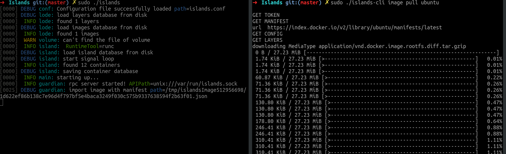

+ 导入一个 docker 格式的镜像

`sudo ./islands-cli image import ubuntu.tar ubuntu --type docker`

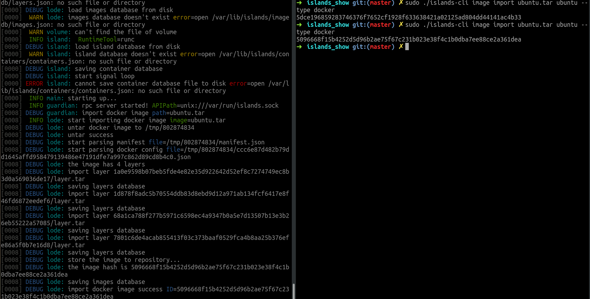

+ 查看所有的镜像

`sudo ./islands-cli image list`
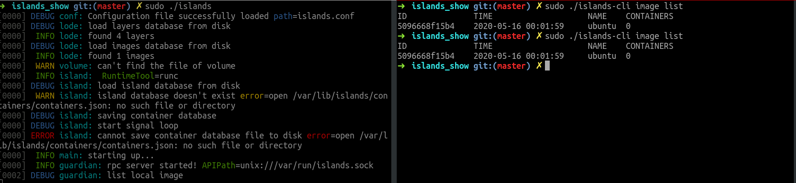

+ 完整功能

`sudo ./islands-cli image -h`

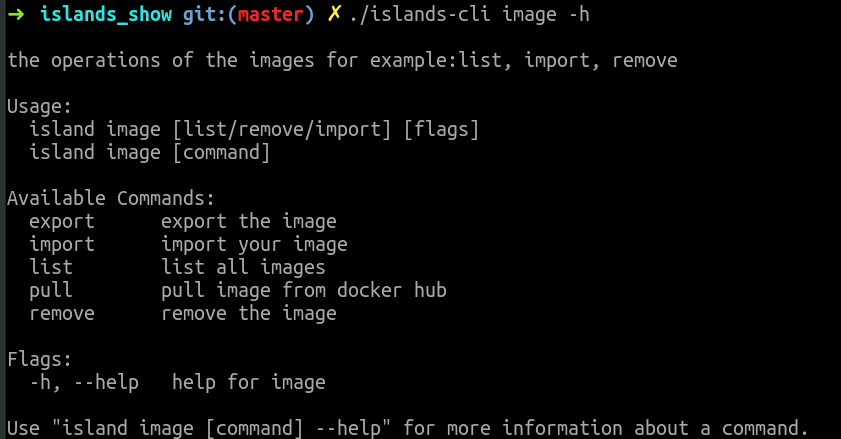

### 容器

+ 创建一个容器

`sudo ./islands-cli container create --name c1 ubuntu echo "hello world"`

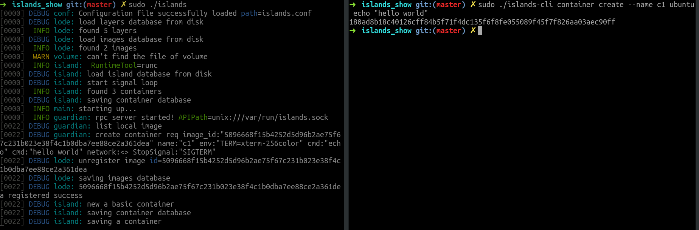

+ -it run 一个容器

`sudo ./islands-cli run -it ubuntu bash`

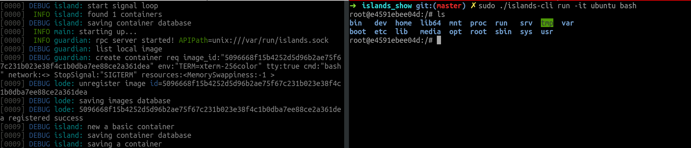

+ 拿到容器的 log

`sudo ./islands-cli logs 3aab018c835e1d2fd040a3f0e8f4b19e8a92e5acdb50710b49aecda110b3cb1a --stdout --tail 10`

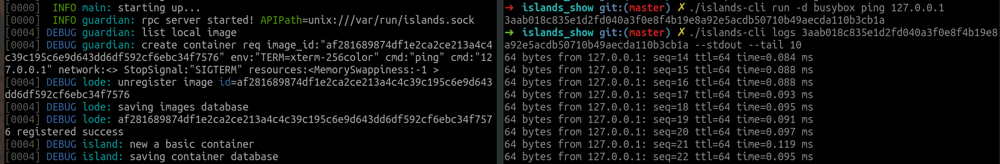

+ 等待、删除、停止一个容器

只展示停止

`sudo ./islands-cli container stop 3aab018c835e1d2fd040a3f0e8f4b19e8a92e5acdb50710b49aecda110b3cb1a`

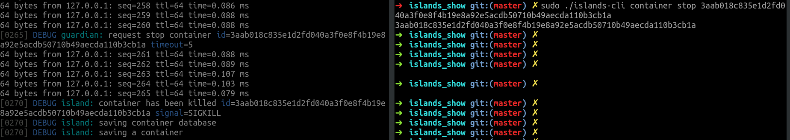

+ 查看所有的容器

`sudo ./islands-cli container list`

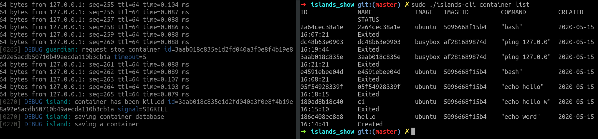

+ 完整功能

`sudo ./islands-cli container -h`

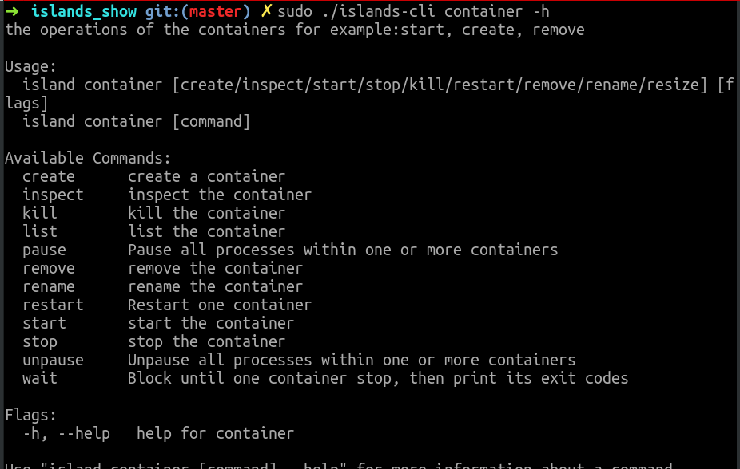

### 卷

+ 创建一个卷

`sudo ./islands-cli volume create v3`

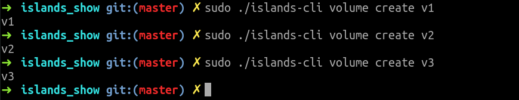

